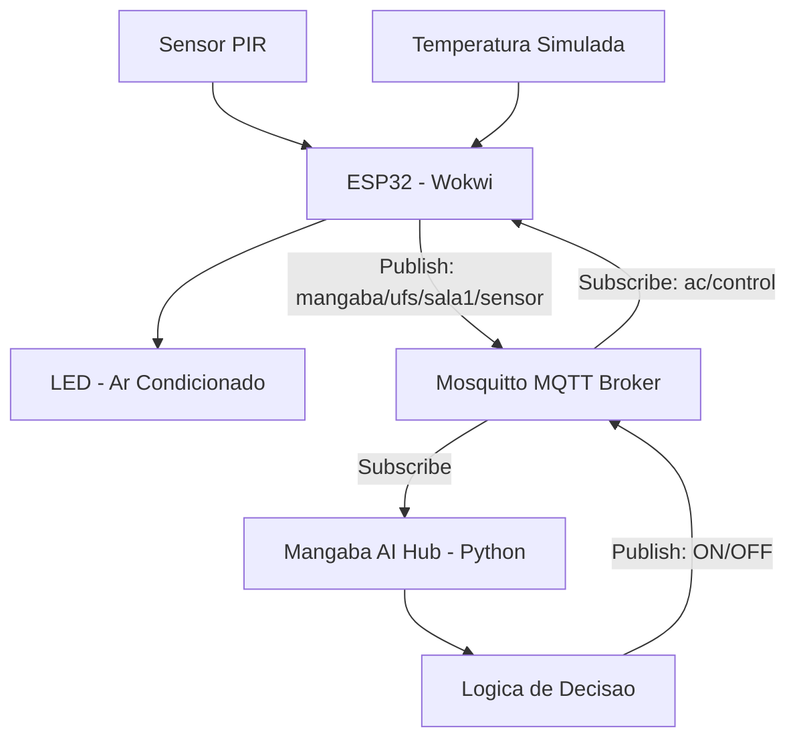

### ✅ Diagrama 



---

# 🚀 Projeto (sem nome) – Powered by Mangaba AI

### MVP de Automação Inteligente (ESP32 + Wokwi + MQTT + Python)

Este repositório contém um MVP **Powered by Mangaba AI** para automação inteligente usando ESP32, Wokwi, MQTT e um Hub Python com lógica de decisão.

---

## 🧠 Arquitetura do Sistema

**Diagrama válido no GitHub:**
*(já está acima — copie e cole direto)*

---

## 📦 Requisitos

### Hub Python

* Python 3
* `paho-mqtt`
* Mosquitto MQTT Broker

### ESP32 (Wokwi)

* Sensor PIR
* LED
* ArduinoJson
* PubSubClient

---

## 🔧 Instalação

### 1️⃣ Instale Mosquitto

Linux/macOS:

```bash
sudo apt install mosquitto mosquitto-clients
```

Windows:
[https://mosquitto.org/download/](https://mosquitto.org/download/)

### 2️⃣ Teste o broker

```bash
mosquitto_sub -h localhost -t test -v
```

```bash
mosquitto_pub -h localhost -t test -m "ok"
```

### 3️⃣ Configure o Hub Python

```bash
pip install paho-mqtt
```

Edite no script:

```python
MQTT_BROKER_HOST = "SEU_IP"
```

Execute:

```bash
python mangaba_ai_hub.py
```

### 4️⃣ Configure o ESP32 no Wokwi

`secrets.h`:

```c
#define SECRET_SSID "Wokwi-GUEST"
#define SECRET_PASS ""
```

`main.ino`:

```cpp
const char* mqtt_server = "SEU_IP";
```

Start Simulation.

---

## 🎮 Funcionamento

* O ESP32 monitora movimento e temperatura
* Publica no MQTT
* O Hub Python processa
* A lógica decide ON/OFF
* O LED no Wokwi representa o ar-condicionado

---
